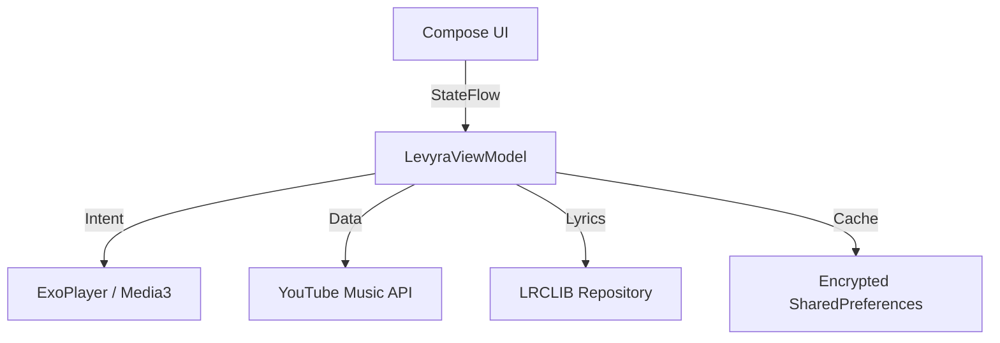

<div align="center">


<br><br>

**The Next-Generation Hi-Fi Music Streaming Client for Android**

*Engineered with precision. Wrapped in a premium developer-tool dashboard.*

<br>

[](https://kotlinlang.org/)
[](https://developer.android.com/jetpack/compose)
[](https://developer.android.com/guide/topics/media/media3)
[](LICENSE)

<br>

[Features](#-key-features) • [Architecture](#-architecture) • [Getting Started](#-getting-started) • [Disclaimer](#-legal-disclaimer)

---
</div>

> **Levyra** is designed for developers and audiophiles who demand uncompromising performance wrapped in an ultra-premium, distraction-free aesthetic. Combining a **Modern SaaS Dashboard** design system with the intuitive discovery engine of **YouTube Music**, it delivers a seamless, instantaneous listening experience.

<br>

## ✦ Key Features

### 1. Minimalist "SaaS" Aesthetic
- **Zero-Clutter Interface:** A meticulously crafted dark mode (`#030407`) utilizing translucent glassmorphism panels, hairline borders, and subtle typographic hierarchy.
- **Dynamic Adaptability:** Fluid mesh gradients dynamically adapt to the album artwork, providing ambient coloration without sacrificing contrast.
- **Command-K Paradigm:** A lightning-fast search dock and floating navigation bar, inspired by top-tier developer tools.

### 2. Intelligent Discovery Engine
- **Predictive Autocomplete:** Real-time search suggestions with instant query completion.
- **Recent Shelf:** A horizontally scrolling, perfectly snapped shelf displaying elegantly formatted landscape cards of your recent plays.
- **Voice Integration:** Native, ultra-responsive voice search directly within the search header.

### 3. Audiophile-Grade Playback
- **Media3 & ExoPlayer:** Rock-solid foreground playback service natively supporting lock screen controls and background execution.
- **Zero-Latency Prefetching:** Aggressive pre-buffering of upcoming queue items guarantees seamless, instantaneous track transitions.
- **Time-Synced Lyrics:** A highly responsive, auto-scrolling lyric engine mapped flawlessly to the vocal track.
- **Smart DSP:** Includes native **SponsorBlock** integration to automatically skip non-music segments, plus **Skip Silence** to compress dead air.

---

## ✦ Technical Architecture

Built purely with modern Android paradigms. LEVYRA strictly adheres to **Clean Architecture** and **MVVM**, guaranteeing a highly testable, scalable, and crash-resistant codebase.

<div align="center">



</div>

| Layer | Description | Stack |
| :--- | :--- | :--- |
| **Presentation** | Declarative components driven by a single unified UI State. | `Jetpack Compose` |
| **Domain** | Core business models, playback logic, and media resolving engines. | `Kotlin Coroutines` |
| **Data** | Caching, local persistence, and remote API abstraction layers. | `Retrofit`, `OkHttp`, `Coil` |

---

## ✦ Getting Started

**Requirements:**
- Android Studio Jellyfish (or newer)
- Android SDK 34+
- JDK 17

**Build Instructions:**
```bash
git clone https://github.com/LUC4N3X/LevyraPlayer.git
cd LevyraPlayer
./gradlew installDebug
```

---

## ✦ Credits

<table style="border-collapse: collapse; border: none;">
  <tr style="border: none;">
    <td align="center" valign="middle" width="120" style="border: none; padding: 10px;">
      <a href="https://github.com/LUC4N3X">
        
      </a>
    </td>
    <td valign="middle" style="border: none; padding: 10px;">
      <h3 style="margin: 0; padding: 0;">LUC4N3X</h3>
      <p style="margin: 4px 0; color: #888; font-size: 14px;"><strong>Creator & Lead Engineer</strong></p>
      <p style="margin: 0; font-size: 13px;">Architect of the UI layer, playback engine, background services, and caching pipelines.</p>
    </td>
  </tr>
</table>

**Inspirations:**
Special thanks to [Metrolist](https://github.com/MetrolistGroup/Metrolist) for pioneering modular catalog navigation paradigms.

---

## ✦ Legal Disclaimer

> [!WARNING]  
> **EDUCATIONAL PURPOSES ONLY**  
>
> LEVYRA is an open-source media client designed strictly for educational and research purposes.
> - **No Hosting:** This app does not host, store, or distribute copyrighted media. All audio streams are resolved dynamically via public APIs.
> - **No Affiliation:** The developer is not affiliated with Google LLC, YouTube, or any partners.
> - **Liability:** Use of this application is entirely at your own risk. The developer assumes no liability for copyright infringement, account suspensions, or data usage. Ensure compliance with your local laws and the Terms of Service of third-party platforms.
