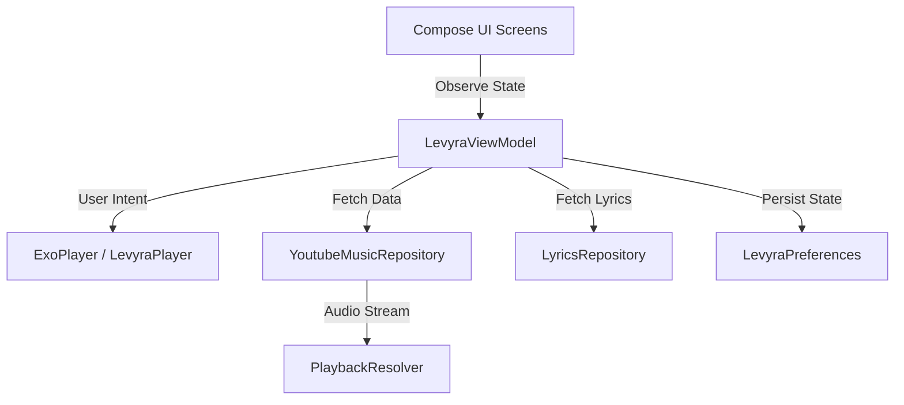

<p align="center">
  
</p>

<h1 align="center">LEVYRA</h1>

<p align="center">
  <strong>A premium, high-performance music streaming player for Android.</strong>
</p>

<p align="center">
  <a href="https://kotlinlang.org/"></a>
  <a href="https://developer.android.com/jetpack/compose"></a>
  <a href="https://developer.android.com/guide/topics/media/media3"></a>
  <a href="https://github.com/LUC4N3X/levyra-deepsound/blob/main/LICENSE"></a>
</p>

<p align="center">
  Designed for developers and music lovers who appreciate sleek, modern aesthetics. LEVYRA combines a <strong>Modern SaaS Landing Page & Developer Tool Dashboard</strong> design system with the clean, intuitive search UX of <strong>YouTube Music</strong>.
</p>

---

## ✨ Key Features

### 🎨 Premium Aesthetics & UI
- **Soft Glassmorphism**: Translucent panels with hairline borders and deep dark backdrops (`#030407`).
- **Dynamic Color Accents**: The background mesh gradient and UI highlights dynamically adapt to the color palette of the current track's album art.
- **SaaS Dashboard Layout**: A floating navigation bar, a Command-K search dock, and glowing progress indicators.

### 🔍 YouTube Music Search Experience
- **YTM-Inspired Search**: Clean search header featuring quick back navigation, microphone voice search, and visualizer indicators.
- **Ricerche Recenti (Recent Searches)**: A horizontal scrolling shelf displaying landscape cards of your recently played tracks.
- **Smart Completions & Suggestions**: A vertical list of trending artists and real-time search completions featuring diagonal autocomplete arrows (`↖`).

### ⚡ Advanced Playback Engine
- **AndroidX Media3 & ExoPlayer**: A robust foreground playback service supporting background play and lock screen media controls.
- **Aggressive Audio Prefetching**: Smart pre-buffering of upcoming tracks in your queue to ensure zero-latency, instant transitions.
- **Time-Synced Lyrics**: Dynamic, auto-scrolling lyrics overlay that perfectly tracks the song's position.
- **SponsorBlock Integration**: Automatically skips sponsored segments, intros, and non-music sections.
- **Skip Silence**: Intelligent audio processing to compress silent pauses in tracks.
- **Smart Sleep Timer**: Pauses your music automatically after a set duration.

---

## 🛠️ Tech Stack

- **UI Framework**: [Jetpack Compose](https://developer.android.com/jetpack/compose) (100% Declarative UI)
- **Audio Engine**: [AndroidX Media3](https://developer.android.com/guide/topics/media/media3) + [ExoPlayer](https://developer.android.com/guide/topics/media/exoplayer)
- **Concurrency**: Kotlin Coroutines & Reactive [StateFlow](https://kotlinlang.org/api/kotlinx.coroutines/kotlinx-coroutines-core/kotlinx.coroutines.flow/-state-flow/)
- **Image Pipeline**: [Coil](https://github.com/coil-kt/coil) (with custom low-memory RGB_565 caching)
- **Local Persistence**: Encrypted SharedPreferences + JSON Serialization
- **Network**: Retrofit & OkHttp

---

## 📐 Architecture

LEVYRA is built following **Clean Architecture** and **MVVM** principles to ensure modularity, testability, and performance:



- **Presentation Layer**: Declarative Compose components (`LevyraApp`, `HomeScreen`, `SearchScreen`, etc.) observing a single unified state.
- **Domain Layer**: Core business models (`Track`, `Mood`, `LyricLine`) and engines.
- **Data Layer**: Repositories managing remote APIs (YouTube Music, Apple Music Charts, LRCLIB) and local caching.

---

## 🚀 Getting Started

### Prerequisites
- Android Studio Jellyfish (or newer)
- Android SDK 34+
- JDK 17

### Building the Project
1. Clone the repository:
   ```bash
   git clone https://github.com/LUC4N3X/levyra-deepsound.git
   ```
2. Open the project in Android Studio.
3. Sync the Gradle files.
4. Run the app on an emulator or a physical device:
   ```bash
   ./gradlew installDebug
   ```

---

## 📄 License

This project is licensed under the MIT License - see the [LICENSE](LICENSE) file for details.
