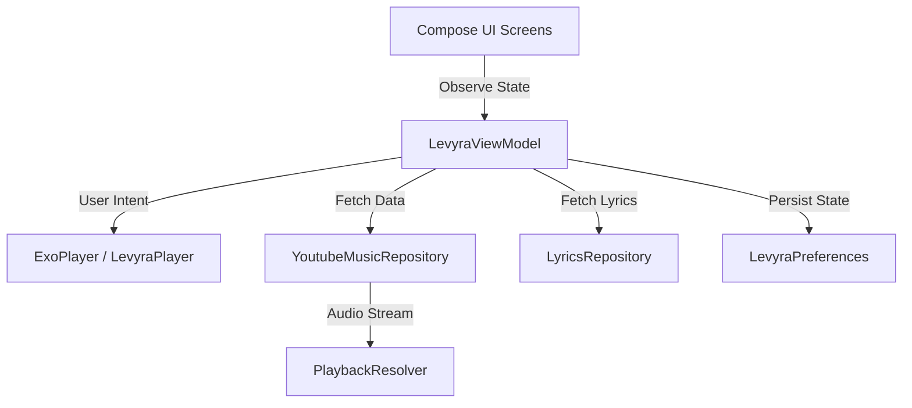

<div align="center">
  

  # ─── LEVYRA ───

  ### **A modern Android music player**
  
  *Deep ocean visuals, smart discovery, rich artwork, and immersive playback.*

  [Features](#-key-features) • [Architecture](#-architecture) • [Getting Started](#-getting-started) • [Disclaimer](#-legal-disclaimer-esonero-responsabilit%C3%A0)

  <br>

  [](https://kotlinlang.org/)
  [](https://developer.android.com/jetpack/compose)
  [](https://developer.android.com/guide/topics/media/media3)
  [](LICENSE)

  <br>

  ---
</div>

Designed for music lovers who appreciate a stunning, immersive visual experience. LEVYRA abandons generic aesthetics for a vibrant **Deep Ocean & Neon** design language. It brings your music to life with dynamic gradients, soft glassmorphism, and a meticulously crafted user interface that feels both futuristic and organic.

---

## ✨ Key Features

### 🌊 Deep Ocean Visuals & Neon Accents
- **Immersive Theming**: A deep navy backdrop (`#050A1F`) accented by vibrant Cyan (`#00E5FF`) and Pink/Magenta (`#FF007A`) neon highlights.
- **Dynamic Artwork Mesh**: The UI seamlessly adapts its mesh gradients to the color palette of the currently playing track's album art.
- **Glassmorphic Overlays**: Translucent, frosted-glass panels with subtle hairline borders that create a profound sense of depth.

### 🔍 Smart Discovery
- **YTM-Inspired Search Engine**: A powerful, clean search header featuring voice input, real-time visualizers, and quick back navigation.
- **Recent Searches Shelf**: A beautifully animated horizontal shelf displaying landscape cards of your most recently played tracks.
- **Predictive Autocomplete**: Instant search completions with intelligent suggestions to help you discover new music faster.

### 🎧 Immersive Playback
- **Media3 & ExoPlayer Engine**: A highly robust foreground playback service supporting background play and lock screen media controls.
- **Zero-Latency Prefetching**: Smart pre-buffering of the upcoming queue ensures instantaneous, gapless transitions between tracks.
- **Time-Synced Lyrics**: A dynamic, auto-scrolling lyrics overlay that perfectly tracks the vocal performance.
- **SponsorBlock Integration**: Automatically skips sponsored segments, intros, and non-music sections for an uninterrupted experience.
- **Smart Sleep Timer & Skip Silence**: Intelligent audio processing to compress silent pauses, plus an automatic sleep timer.

---

## 🛠️ Tech Stack

- **UI Framework**: [Jetpack Compose](https://developer.android.com/jetpack/compose) (100% Declarative UI)
- **Audio Engine**: [AndroidX Media3](https://developer.android.com/guide/topics/media/media3) + [ExoPlayer](https://developer.android.com/guide/topics/media/exoplayer)
- **Concurrency**: Kotlin Coroutines & Reactive [StateFlow](https://kotlinlang.org/api/kotlinx.coroutines/kotlinx-coroutines-core/kotlinx.coroutines.flow/-state-flow/)
- **Image Pipeline**: [Coil](https://github.com/coil-kt/coil) (with custom RGB_565 caching for ultimate performance)
- **Local Persistence**: Encrypted SharedPreferences + JSON Serialization
- **Network**: Retrofit & OkHttp

---

## 📐 Architecture

LEVYRA is built following strict **Clean Architecture** and **MVVM** principles to ensure absolute modularity, testability, and peak performance:



- **Presentation Layer**: Declarative Compose components (`LevyraApp`, `HomeScreen`, `SearchScreen`, etc.) observing a single, unified state.
- **Domain Layer**: Core business models (`Track`, `Mood`, `LyricLine`) and engines.
- **Data Layer**: Repositories managing remote APIs (YouTube Music, Apple Music Charts, LRCLIB) and local caching.

---

## 🚀 Getting Started

### Prerequisites
- Android Studio Jellyfish (or newer)
- Android SDK 34+
- JDK 17

### Building the Project
1. Clone the repository:
   ```bash
   git clone https://github.com/LUC4N3X/LevyraPlayer.git
   ```
2. Open the project in Android Studio.
3. Sync the Gradle files.
4. Run the app on an emulator or a physical device:
   ```bash
   ./gradlew installDebug
   ```

---

## 🤝 Credits & Acknowledgements

<table style="border: none;">
  <tr>
    <td align="center" valign="middle" width="120" style="border: none;">
      <a href="https://github.com/LUC4N3X">
        
      </a>
    </td>
    <td valign="middle" style="border: none;">
      <h3 style="margin: 0; color: #FF007A;"><strong>LUC4N3X</strong></h3>
      <p style="margin: 5px 0;"><strong>Creator & Lead Developer</strong></p>
      <p style="margin: 0; color: #8892B0;">Architected the UI redesign, player integration, background services, and caching pipelines.</p>
    </td>
  </tr>
</table>

### 💡 Inspirations & Special Thanks

*   **[Metrolist](https://github.com/MetrolistGroup/Metrolist)** — Special thanks for inspiring the design paradigms, modular list flows, and seamless catalog navigation concepts.

---

## ⚖️ Legal Disclaimer (Esonero Responsabilità)

> [!WARNING]
> **PLEASE READ CAREFULLY**

LEVYRA is an open-source media client designed and developed strictly for **educational, personal, and research purposes**. 

- **No Media Hosting**: This application does not host, store, download, or distribute any copyrighted media files or audio streams. All audio resources are resolved dynamically and streamed directly from public third-party platforms (such as YouTube and YouTube Music) via public APIs.
- **Third-Party Terms**: The developer ([LUC4N3X](https://github.com/LUC4N3X)) is in no way affiliated with, authorized, maintained, sponsored, or endorsed by YouTube, Google LLC, or any of their affiliates or partners. Users are solely responsible for ensuring that their use of this application complies with applicable local laws and the Terms of Service of the respective streaming platforms.
- **Limitation of Liability**: Under no circumstances shall the developer be held liable for any copyright infringement, data usage, account suspensions, or legal disputes arising from the use or misuse of this software. The software is provided **"as is"**, without warranty of any kind, express or implied. Use of this application is entirely at your own risk.
