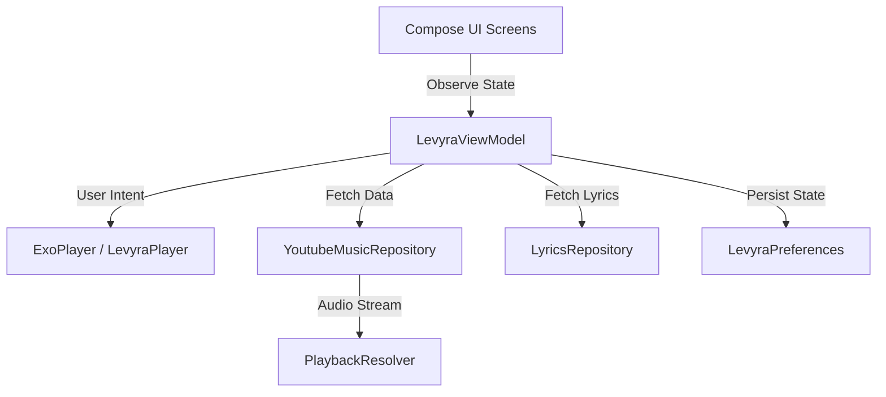

<div align="center">
  

  # ─── LEVYRA ───

  ### **The Next-Generation Hi-Fi Music Streaming Client for Android**

  *Engineered with precision. Wrapped in a premium developer-tool dashboard.*

  [Features](#-key-features) • [Architecture](#-architecture) • [Getting Started](#-getting-started) • [Disclaimer](#-legal-disclaimer-esonero-responsabilit%C3%A0)

  <br>

  [](https://kotlinlang.org/)
  [](https://developer.android.com/jetpack/compose)
  [](https://developer.android.com/guide/topics/media/media3)
  [](LICENSE)

  <br>

  ---
</div>

Designed for developers and music lovers who appreciate sleek, modern aesthetics. LEVYRA combines a **Modern SaaS Landing Page & Developer Tool Dashboard** design system with the clean, intuitive search UX of **YouTube Music**.

---

## ✨ Key Features

### 🎨 Premium Aesthetics & UI
- **Soft Glassmorphism**: Translucent panels with hairline borders and deep dark backdrops (`#030407`).
- **Dynamic Color Accents**: The background mesh gradient and UI highlights dynamically adapt to the color palette of the current track's album art.
- **SaaS Dashboard Layout**: A floating navigation bar, a Command-K search dock, and glowing progress indicators.

### 🔍 YouTube Music Search Experience
- **YTM-Inspired Search**: Clean search header featuring quick back navigation, microphone voice search, and visualizer indicators.
- **Ricerche Recenti (Recent Searches)**: A horizontal scrolling shelf displaying landscape cards of your recently played tracks.
- **Smart Completions & Suggestions**: A vertical list of trending artists and real-time search completions featuring diagonal autocomplete arrows (`↖`).

### ⚡ Advanced Playback Engine
- **AndroidX Media3 & ExoPlayer**: A robust foreground playback service supporting background play and lock screen media controls.
- **Aggressive Audio Prefetching**: Smart pre-buffering of upcoming tracks in your queue to ensure zero-latency, instant transitions.
- **Time-Synced Lyrics**: Dynamic, auto-scrolling lyrics overlay that perfectly tracks the song's position.
- **SponsorBlock Integration**: Automatically skips sponsored segments, intros, and non-music sections.
- **Skip Silence**: Intelligent audio processing to compress silent pauses in tracks.
- **Smart Sleep Timer**: Pauses your music automatically after a set duration.

---

## 🛠️ Tech Stack

- **UI Framework**: [Jetpack Compose](https://developer.android.com/jetpack/compose) (100% Declarative UI)
- **Audio Engine**: [AndroidX Media3](https://developer.android.com/guide/topics/media/media3) + [ExoPlayer](https://developer.android.com/guide/topics/media/exoplayer)
- **Concurrency**: Kotlin Coroutines & Reactive [StateFlow](https://kotlinlang.org/api/kotlinx.coroutines/kotlinx-coroutines-core/kotlinx.coroutines.flow/-state-flow/)
- **Image Pipeline**: [Coil](https://github.com/coil-kt/coil) (with custom low-memory RGB_565 caching)
- **Local Persistence**: Encrypted SharedPreferences + JSON Serialization
- **Network**: Retrofit & OkHttp

---

## 📐 Architecture

LEVYRA is built following **Clean Architecture** and **MVVM** principles to ensure modularity, testability, and performance:



- **Presentation Layer**: Declarative Compose components (`LevyraApp`, `HomeScreen`, `SearchScreen`, etc.) observing a single unified state.
- **Domain Layer**: Core business models (`Track`, `Mood`, `LyricLine`) and engines.
- **Data Layer**: Repositories managing remote APIs (YouTube Music, Apple Music Charts, LRCLIB) and local caching.

---

## 🚀 Getting Started

### Prerequisites
- Android Studio Jellyfish (or newer)
- Android SDK 34+
- JDK 17

### Building the Project
1. Clone the repository:
   ```bash
   git clone https://github.com/LUC4N3X/levyra-deepsound.git
   ```
2. Open the project in Android Studio.
3. Sync the Gradle files.
4. Run the app on an emulator or a physical device:
   ```bash
   ./gradlew installDebug
   ```

---

## 🤝 Credits & Acknowledgements

<table>
  <tr>
    <td align="center" valign="middle" width="120">
      <a href="https://github.com/LUC4N3X">
        
      </a>
    </td>
    <td valign="middle">
      <h3><strong>LUC4N3X</strong></h3>
      <p><strong>Creator & Lead Developer</strong></p>
      <p>Architected the UI redesign, player integration, background services, and caching pipelines.</p>
    </td>
  </tr>
</table>

### 💡 Inspirations & Special Thanks

*   **[Metrolist](https://github.com/MetrolistGroup/Metrolist)** — Special thanks for inspiring the design paradigms, modular list flows, and seamless catalog navigation concepts.

---

## ⚖️ Legal Disclaimer (Esonero Responsabilità)

> [!WARNING]
> **PLEASE READ CAREFULLY**

LEVYRA is an open-source media client designed and developed strictly for **educational, personal, and research purposes**. 

- **No Media Hosting**: This application does not host, store, download, or distribute any copyrighted media files or audio streams. All audio resources are resolved dynamically and streamed directly from public third-party platforms (such as YouTube and YouTube Music) via public APIs.
- **Third-Party Terms**: The developer ([LUC4N3X](https://github.com/LUC4N3X)) is in no way affiliated with, authorized, maintained, sponsored, or endorsed by YouTube, Google LLC, or any of their affiliates or partners. Users are solely responsible for ensuring that their use of this application complies with applicable local laws and the Terms of Service of the respective streaming platforms.
- **Limitation of Liability**: Under no circumstances shall the developer be held liable for any copyright infringement, data usage, account suspensions, or legal disputes arising from the use or misuse of this software. The software is provided **"as is"**, without warranty of any kind, express or implied. Use of this application is entirely at your own risk.
